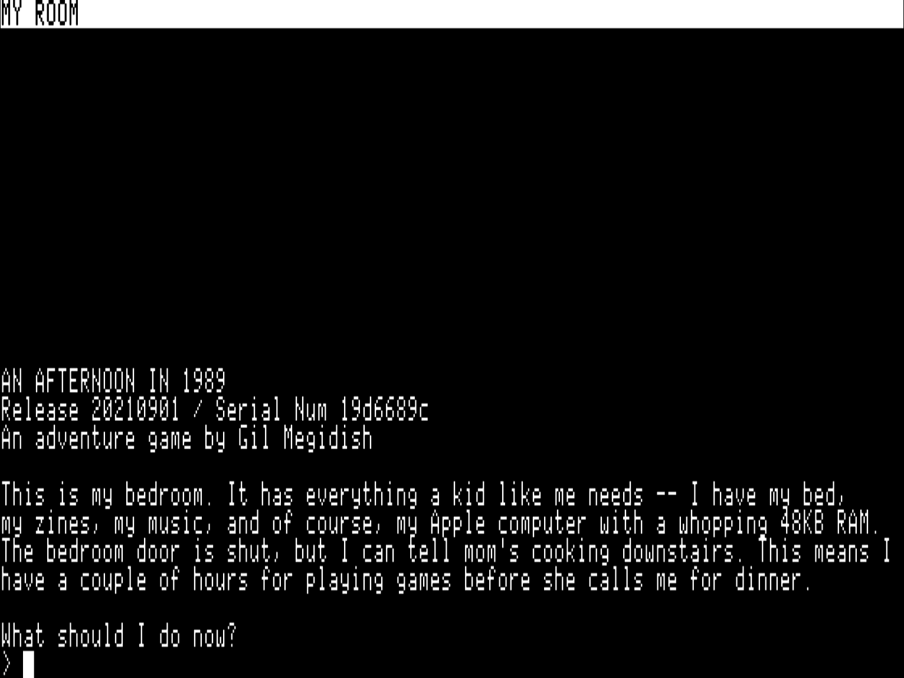

### A Day in 1989

A single-room interactive fiction for the Apple II, written for the one-room-applesoft-basic practice on [Apple II Software Enthusiasts](https://www.facebook.com/groups/418327412201896) group on facebook.

You are a kid, 9 year old. You just came back from school, mom's cooking dinner downstairs and it's time to play some Apple II games.

Your life is just perfect!

.. or is it?

##### Technical

- The game was written in two evenings. One for writing the texts, and the other for writing the code.

- Interactive fiction (text adventure games) are often written with string tokenizers, vocabulary and thesaurus. I took a different approach -- I played the game on a text editor, writing all the commands I could think of to do a specific task or name a specific item. In the source code you'll just see a list of the commands I came up with. I aimed for speed of development, rather than an engine that can be used later for another game.

##### License

This game is free for play and is released under GNU Public License (GPL)
